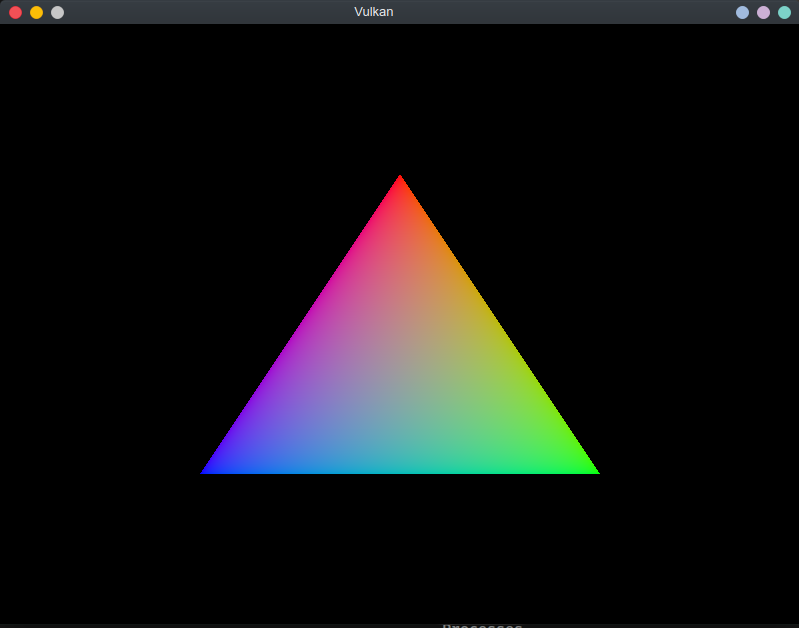

# Hello Triangle Vulkan Tutorial

Just me learning how to use Vulkan.
I'm using [this wonderful Vulkan tutorial].

[this wonderful Vulkan tutorial]: https://vulkan-tutorial.com/

It took about **1200** LoC, but I can finally draw a single triangle on screen.

## How to build

Make sure the [Vulkan SDK] is installed, along with [GLFW] and [GLM].
Then, run `make` to generate the executable.
Run `make clean` to remove all generated files.

[Vulkan SDK]: https://vulkan.lunarg.com/sdk/home
[GLFW]: https://www.glfw.org/
[GLM]: https://glm.g-truc.net/0.9.9/index.html

## How to run

### Linux instructions

Run `make test`.
If you have an NVIDIA card with [PRIME Render Offload] enabled, run `make test offload=yes`.

[PRIME Render Offload]: https://download.nvidia.com/XFree86/Linux-x86_64/455.45.01/README/primerenderoffload.html

## Bugs

* ~~Running the program makes my computer screen flicker every couple of seconds.~~
  As it turns out, this has something to do with the GPU the program is running on. Using my NVIDIA
  card produces no issues.
